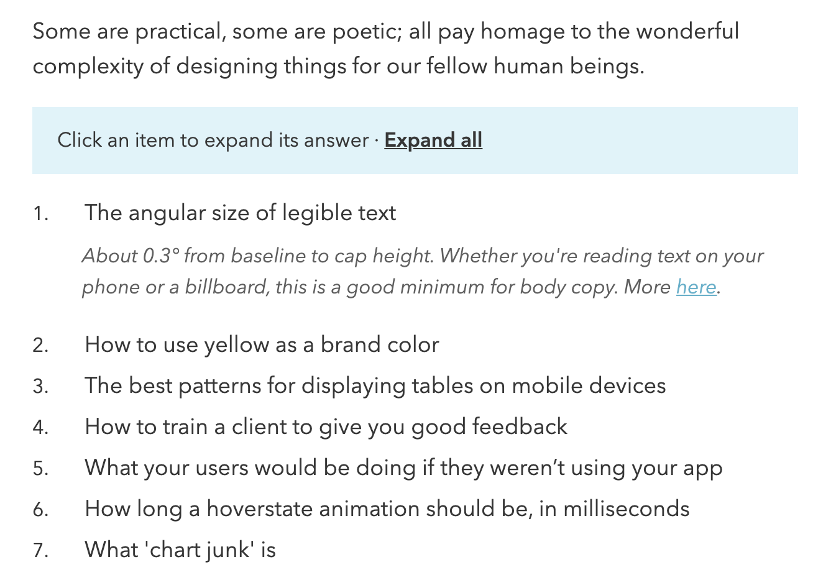

# Retrieving data from URL via XPath and HTML in Google Sheets

Here is what we will do:

Take a website and pull out data to Google sheets via `=IMPORTXML()` function. [Formula documentation we can find here](https://support.google.com/docs/answer/3093342?hl=en "IMPORTXML Google Sheets").

##

[Here we have a data](https://learnui.design/blog/100-things-ux-ui-designer-know.html "100 things designer should know"), where we have a list of elements and inside that list there is a hidden element that is opening up with expanding it.

(https://docs.google.com/spreadsheets/d/1fy2en_Ql-8kMj5e_suqOEuehTAPo55lwBp3gFY2Sr9M/edit?usp=sharing)